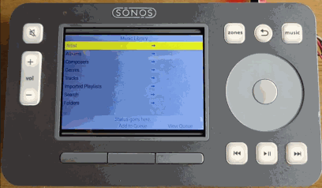

# CR101fw
The firmware software for the CR101 controller.
Version 2 has 2 microcontrollers that need
firmware, an Atmega328**PB** as the master
and an **ATtiny1614**.  
The 328 manages 
communications with the Pi, reads buttons,
monitors battery charge, screen on/off.
The 1614 manages the red, green and orange
LEDs, the white button lighting and the scroll wheel.  
The Raspberry Pi runs the SoCo controller, the
user interface and communicates with the 328. The python
code for the Raspberry Pi is at https://github.com/quezadaminter/CR101py  

 

